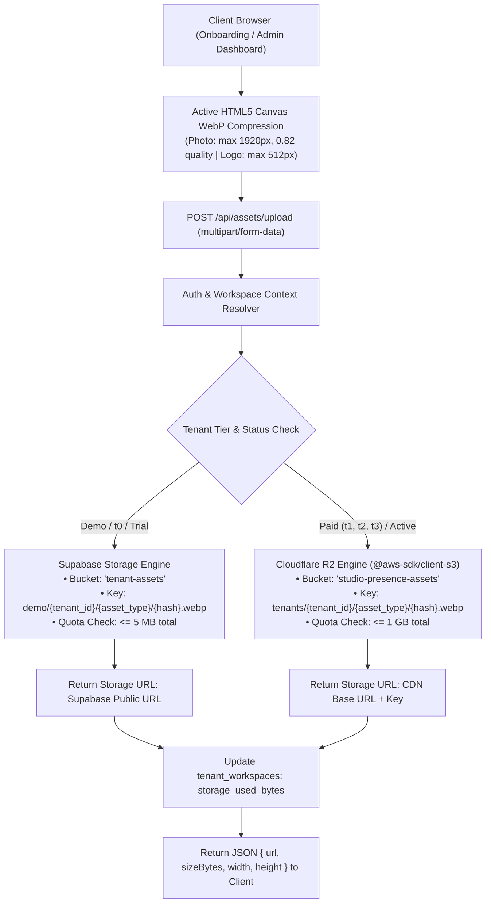

# Specification: Dual-Tier Storage Architecture (Demo vs Paying Tenants)

**Status**: Approved Architecture  
**Date**: 2026-09-18  
**Scope**: Media storage, upload pipelines, asset delivery, and database schema for Studio Presence multi-tenant sites.

---

## 1. Problem Statement & Motivation

Interior design studio websites are inherently media-heavy. A complete studio showcase can contain 30–80 high-resolution photos (living rooms, modular kitchens, joinery details, finishes).

1. **Supabase Free Tier Limits**:
   - Storage: 1 GB.
   - Egress Bandwidth: 2 GB / month.
   - If paying tenants host full 25 MB portfolios on Supabase, just 160–200 website visits a month exhaust the entire project egress bandwidth, causing throttling or unexpected charges.

2. **Cloudflare R2 Advantages**:
   - Storage: 10 GB free monthly tier ($0.015/GB/mo thereafter).
   - **Egress Bandwidth: $0.00 FOREVER (Zero egress fees)**.
   - Global Anycast CDN with sub-millisecond edge caching and custom domain SSL.

3. **Separation Principle**:
   - **Demo / Unpaid Users (`t0`, status `demo`)**: Ephemeral, low-risk, lightweight. Kept on Supabase Storage with strict quotas (max 5 MB) and short lifecycles.
   - **Paying Customers (`t1`, `t2`, `t3`, status `active`)**: Enterprise-grade media hosting on Cloudflare R2 with dedicated asset URLs, high capacity, and unlimited egress.

---

## 2. Storage Tier Decision Matrix

| Dimension | Tier: Demo (`t0` / `demo`) | Tier: Paying (`t1`, `t2`, `t3` / `active`) |
| :--- | :--- | :--- |
| **Storage Backend** | Supabase Storage (`tenant-assets`) | Cloudflare R2 (`studio-presence-assets`) |
| **Storage Prefix** | `demo/{tenant_id}/` | `tenants/{tenant_id}/` |
| **Quota per Studio** | **5 MB** (Logo + 1–3 compressed photos) | **500 MB – 2 GB** (Full portfolio galleries) |
| **Bandwidth / Egress** | Capped by Supabase 2 GB pool | **Uncapped / $0 Egress Forever** |
| **Public Delivery URL** | Supabase public storage URL | Custom CDN domain (`assets.<domain>` or `pub-xxx.r2.dev`) |
| **Client Compression** | Active HTML5 Canvas (WebP, max 1920px) | Active HTML5 Canvas (WebP, max 1920px) |
| **Lifecycle** | Purged after demo expiration | Permanent while subscription active |

---

## 3. Upload Flow & The Conditional Routing Engine



---

## 4. Database Schema Impact (`tenant_workspaces`)

To support dynamic storage switching without code alterations, the `tenant_workspaces` table stores storage provider configuration per tenant:

```sql
ALTER TABLE tenant_workspaces
  ADD COLUMN storage_provider TEXT NOT NULL DEFAULT 'supabase' CHECK (storage_provider IN ('supabase', 'r2')),
  ADD COLUMN storage_bucket TEXT NOT NULL DEFAULT 'tenant-assets',
  ADD COLUMN storage_prefix TEXT NOT NULL DEFAULT '',
  ADD COLUMN cdn_base_url TEXT,
  ADD COLUMN storage_quota_bytes BIGINT NOT NULL DEFAULT 5242880, -- 5MB default for demo
  ADD COLUMN storage_used_bytes BIGINT NOT NULL DEFAULT 0;
```

### Upgrade Trigger (Demo -> Paid):
When a tenant upgrades from demo (`t0`) to paid (`t1`, `t2`, `t3`):
1. `storage_provider` is flipped to `'r2'`.
2. `storage_bucket` is set to the Cloudflare R2 bucket name (`studio-presence-assets`).
3. `cdn_base_url` is populated with the Cloudflare public CDN domain.
4. `storage_quota_bytes` is expanded to `1073741824` (1 GB).
5. Existing demo assets can be migrated to R2 asynchronously via background worker or left in place until edited.

---

## 5. Security & Isolation Invariants

1. **Zero Hardcoded Secrets**: R2 access keys and Supabase service keys exist only in server-side environment variables (`process.env.R2_SECRET_ACCESS_KEY`).
2. **Tenant Path Isolation**: Every uploaded file key is strictly prefixed with the tenant's workspace ID (`tenants/{tenant_id}/`). Tenants cannot overwrite or read other tenants' private objects.
3. **MIME & Content Validation**: The server validates file magic bytes; only `image/webp`, `image/png`, `image/jpeg`, and `image/svg+xml` are accepted.
4. **Frozen Config Compatibility**: All URLs stored in client configurations follow the schema contract (`backend/src/config/schema.ts`).
